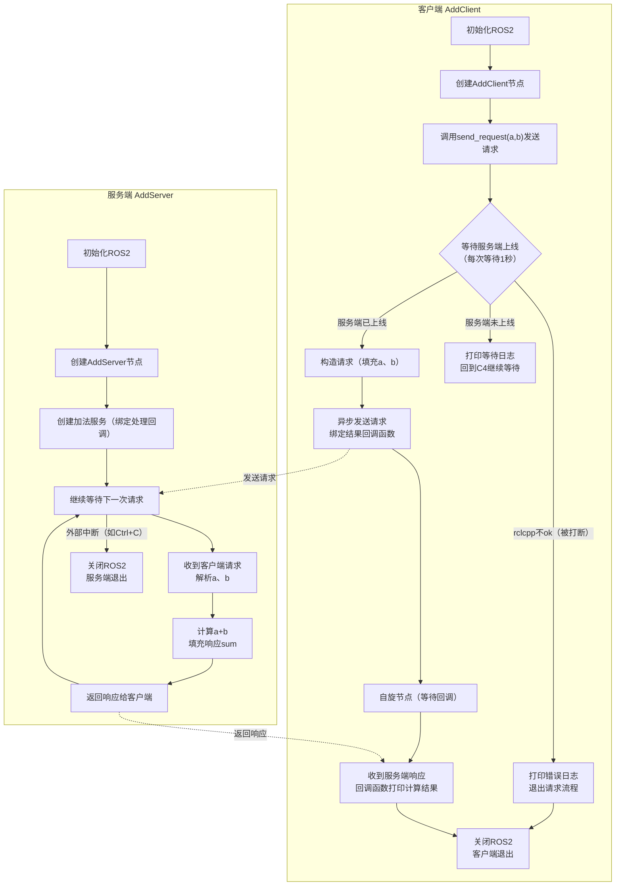

```mermaid
flowchart TD
    %% 客户端（AddClient）流程
    subgraph 客户端 AddClient
        C1["初始化ROS2"] --> C2["创建AddClient节点"]
        C2 --> C3["调用send_request(a,b)发送请求"]
        C3 --> C4{"等待服务端上线<br/>（每次等待1秒）"}
        C4 -->|rclcpp不ok（被打断）| C5["打印错误日志<br/>退出请求流程"]
        C4 -->|服务端未上线| C6["打印等待日志<br/>回到C4继续等待"]
        C4 -->|服务端已上线| C7["构造请求（填充a、b）"]
        C7 --> C8["异步发送请求<br/>绑定结果回调函数"]
        C8 --> C9["自旋节点（等待回调）"]
        C9 --> C10["收到服务端响应<br/>回调函数打印计算结果"]
        C10 --> C11["关闭ROS2<br/>客户端退出"]
        C5 --> C11
    end

    %% 服务端（AddServer）流程
    subgraph 服务端 AddServer
        S1["初始化ROS2"] --> S2["创建AddServer节点"]
        S2 --> S3["创建加法服务（绑定处理回调）"]
        S3 --> S4["自旋节点（等待客户端请求）"]
        S4 --> S5["收到客户端请求<br/>解析a、b"]
        S5 --> S6["计算a+b<br/>填充响应sum"]
        S6 --> S7["返回响应给客户端"]
        S7 --> S4["继续等待下一次请求"]
        %% 退出分支（外部中断时）
        S4 -->|外部中断（如Ctrl+C）| S8["关闭ROS2<br/>服务端退出"]
    end

    %% 客户端与服务端的交互
    C8 -. 发送请求 .-> S4
    S7 -. 返回响应 .-> C10
```


- 打开.md(Markdown)文件,加```mermaid```
- ctrl+shift+v 预览（右击编辑区域->Open Preview）
- 插件：Mermaid Preview / Markdown All in One